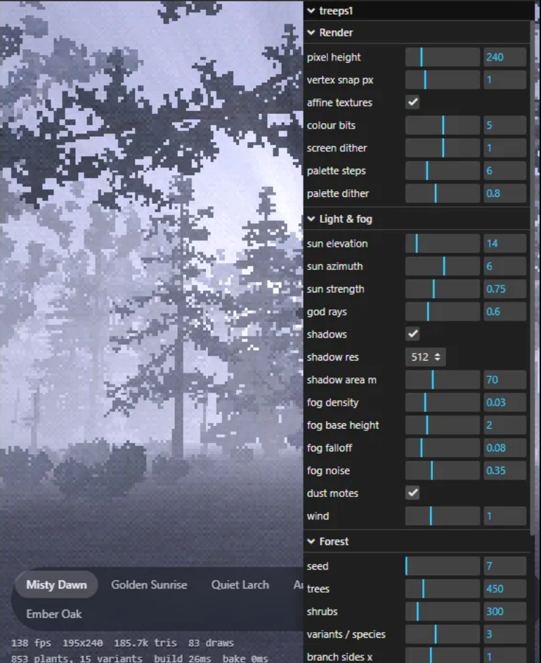

# treeps1 (playtreeone)

A PS1-style tree rendering experiment for the browser. Low-res, vertex-snapped, palette-dithered forests with fog, chunky shadow-mapped dapple and screen-space god rays. The trees are fully procedural: no photo textures. Leaves are rasterised as tiny "pixel candidate" sprites from code and noise. Branches come from L-system-style growth maths. Distant trees switch to baked billboards.



## Run

It's a static site with no build step (Three.js and lil-gui load from a CDN through an import map).

```bash
python -m http.server 8173 --directory .
```

Then open http://localhost:8173. ES modules need a local server; double-clicking `index.html` won't work.

Controls: drag to orbit, right-drag to pan, wheel to zoom, WASD to walk (hold Shift to run). Preset pills are at the top left; every tuning knob is in the panel at the top right.

## Windows screensaver

The Windows host (the `.scr`, its settings dialog and the build script) lives in **[screentreeone](https://github.com/TechyBen/screentreeone)**, which includes this repo as a submodule. Saver mode itself is part of this page (`src/saver.js`, `src/ambience.js`, `src/sun.js`):
- **Scenes**: every *N* minutes (15 by default), fog rolls in over 20 s, a new preset, seed and camera path load behind it, and the fog clears over 25 s. The schedule is driven by the clock, so every monitor changes in sync.
- **Camera**: a slow circle in the clearing, looking out at the trees, with slow head turns, a slight bob and a gently drifting sun.
- **Panorama**: monitors to the left or right of the primary turn the view by one screen width, so the forest continues across them.
- **Sound** (procedural, no samples, primary monitor only): wind that wanders between lulls and swells and also drives the tree sway. Birds come in phases: a 30 s fade-in, a few minutes of activity, then about 10 minutes of quiet. Six call types are synthesised. Each bird has its own pitch, tempo and a small repertoire it repeats with variation, and neighbours sometimes answer.

Try saver mode in a browser with `http://localhost:8173/?saver&mins=1`. Click once to allow sound.

Three.js loads from a CDN, so the screensaver needs an internet connection; WebView2's cache usually covers short outages.

## How it works

| Stage | File | Notes |
|---|---|---|
| Seeded RNG and value noise | `src/rng.js` | Everything reproduces from `seed`. Tree sizes use a Weibull distribution. |
| Palettes | `src/presets.js` | Picked from `/examples`. Each preset has 5 ramps (leaf, leaf2, accent, bark, ground), resampled to *N* steps like a CLUT. |
| Pixel leaves | `src/leafgen.js` | Rasterises blades (broad / lobed / round) or needle sprays (spray / tuft) into 4 cluster tiles. Tiles store **tone indices**, not colours, so a palette swap is free. |
| Tree skeletons | `src/treegen.js` | Honda / Weber–Penn style recursion: branch angle, length ratio, golden-angle roll, crown envelope, tropism, and da Vinci radius rule. Conifers are monopodial whorls on a cone envelope. Species: fir, larch, beech, oak, laurel, bare, snag, shrub. |
| Geometry | `src/treemesh.js` | 3–6 sided tapered prisms for limbs. Leaf clusters are single quads that the vertex shader turns to face the camera. |
| Shaders | `src/materials.js` | Vertex snapping, affine UVs, ramp lookup with Bayer dithering, height fog with drifting noise, 1-tap nearest shadow map, dithered LOD cross-fade. |
| Impostors | `src/impostor.js` | Each variant is baked (lit and self-shadowed) from *N* angles into one atlas row. Far trees are Y-axis billboards that pick the nearest angle. |
| Post | `src/post.js` | The scene renders at e.g. 427×240 with depth. A composite pass adds radial-blur god rays (sky and fog-faded geometry let light through), then quantises to *n*-bit colour with ordered dither. The canvas is CSS-upscaled with `image-rendering: pixelated`. |

Useful knobs to tune pixel size and density: **pixel height**, **cluster tile px** (8–64), **leaf density**, **leaf size**, **palette steps**, **billboard px** and **billboard angles**, and **billboard distance**. Turn on **show atlases** to see the generated leaf tiles and baked billboards.

## Night sky

At night, with the real-time sun on, `src/stars.js` draws about 5,000 real stars down to magnitude 6. They're placed for your latitude and the current sidereal time and tinted by colour index. They fade in at dusk and dim near the horizon and in fog. Twinkling is a slow, soft swell of ±5–15% over 10–25 seconds (stronger low in the sky), so no star ever blinks out. The catalogue (`src/stardata.js`) is packed from [d3-celestial](https://github.com/ofrohn/d3-celestial)'s Hipparcos-derived `stars.6.json`, © 2015 Olaf Frohn, BSD 3-clause; see [licenses/d3-celestial.txt](licenses/d3-celestial.txt).

## Moon

`src/sun.js` also computes the moon's position and phase (the Almanac's low-precision series, about 0.3°, with parallax). `src/moon.js` draws it at its true size, about 0.5° across, which is roughly 2 pixels at 240 lines; the sky's glow gives it a soft halo. Each pixel is shaded as a sphere lit by the true sun direction, so at higher pixel heights the phase and the tilt of the crescent show. At a pixel or two, its brightness follows the lit fraction instead. At night the real moon is the light source: moonlit shadows and faint moonbeams, with brighter nights near full moon. It also shows faintly in the daytime sky. The **time shift (days)** slider moves the sun, moon and stars together to preview other nights.

## Weather

Under **Weather** in the panel, choose `live` to use [Open-Meteo](https://open-meteo.com/) (free, no key, non-commercial use), or `manual` to test with sliders. **look up town** turns a place name into coordinates once, rounded to 0.1° (about 10 km). Weather requests only ever send that rounded location. Readings refresh every 30 minutes and are cached for offline starts.

| Reading | Effect |
|---|---|
| Cloud cover | Dims the sun or moon, light shafts, stars and moon disc; flattens the sky |
| Visibility, fog codes | Fog density |
| Wind speed, gusts and direction | Wind strength and direction for the sway, the wind sound and the drift of rain and snow |
| Drizzle to heavy rain | Streaks get faster, longer and brighter with intensity; heavy rain adds ground splashes. Rain hiss and drips, fewer birds |
| Sleet (rain and snow together, freezing rain, snow grains) | Short white slanting streaks |
| Hail (thunderstorm with hail) | Bright pellets, white skitter on the ground, sharp ticking |
| Snowfall (or precipitation below about 1°C) | Drifting flakes; close ones are 3–7 px pixel crystals that slowly tumble between + and × |

**Wind sway** is one shared function used by branches, leaves and billboards, so leaves stay on their branches and switching to billboards doesn't pop. Trees bend from the root (sway grows with height squared), and gust waves drift across the forest in the wind direction, so you can see a gust roll through. Each tree has its own gentle oscillation and a little cross-wind wobble, with a small leaf flutter on top. Strength follows the gusts you hear when sound is on. Sway also applies in the shadow pass, so shadows move, and is off when billboards are baked.

Live weather can't run inside the claude.ai artifact, because artifacts block outside requests; the manual sliders still work there.

## References

- Honda, *Description of the form of trees by the parameters of the tree-like body* (1971)
- Aono & Kunii, *Botanical tree image generation* (1984)
- Weber & Penn, *Creation and Rendering of Realistic Trees* (SIGGRAPH 1995)
- Runions, Lane & Prusinkiewicz, *Modeling Trees with a Space Colonization Algorithm* (2007), a possible next step for broadleaf crowns
- Mitchell, *Volumetric Light Scattering as a Post-Process* (GPU Gems 3), the basis for the god rays

## Examples folder

`/examples` holds colour-reference photos. They're kept out of git, since some are Unsplash+ licensed. Only `examples/README.md` and `examples/dash.png` (our own render) are tracked.
